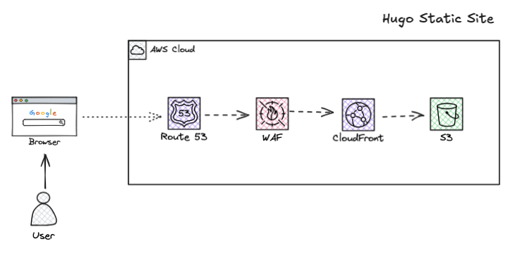

# BuildWithEM Infrastructure 🏗️

Terraform Infrastructure as Code for the BuildWithEM blog and portfolio site. This repository manages all AWS resources required to host a high-performance, secure static website.

## 🌐 Live Site
The infrastructure powers: [buildwithem.com](https://buildwithem.com)

## 🏗️ Architecture Overview

This Terraform configuration creates a complete AWS infrastructure stack:



- **🗂️ S3 Bucket** - Static website hosting with versioning
- **🌐 CloudFront** - Global CDN with custom functions for URL rewriting
- **🛡️ WAF** - Web Application Firewall with managed security rules
- **🌍 Route53** - DNS management for custom domain
- **🔒 ACM** - Free SSL/TLS certificates
- **⚙️ CloudFront Functions** - URL rewriting for clean Hugo URLs

## 📁 Repository Structure

```
buildwithem-infra/
├── main.tf                    # Main Terraform configuration
├── variables.tf               # Input variables
├── outputs.tf                 # Output values
├── terraform.tfvars.example   # Example variable values
├── index-rewrite.js           # CloudFront function for URL rewriting
├── .gitignore                 # Terraform-specific gitignore
└── README.md                  # This file
```

## 🛠️ Technology Stack

- **[Terraform](https://www.terraform.io/)** - Infrastructure as Code
- **[AWS Provider](https://registry.terraform.io/providers/hashicorp/aws/latest)** - AWS resource management
- **AWS Services:**
  - S3 (Static hosting)
  - CloudFront (CDN)
  - Route53 (DNS)
  - ACM (SSL certificates)
  - WAF (Security)
  - CloudFront Functions (URL rewriting)

## 🚀 Quick Start

### Prerequisites

- [Terraform](https://www.terraform.io/downloads.html) >= 1.0
- [AWS CLI](https://aws.amazon.com/cli/) configured with appropriate credentials
- A registered domain name (can be registered through Route53 or external registrar)

### Required AWS Permissions

Your AWS user/role needs these IAM policies:
- `AmazonS3FullAccess`
- `CloudFrontFullAccess`
- `AmazonRoute53FullAccess`
- `AWSWAFv2FullAccess`
- `AWSCertificateManagerFullAccess`

### Setup Instructions

1. **Clone the repository:**
   ```bash
   git clone https://github.com/em-scrn/buildwithem-infra.git
   cd buildwithem-infra
   ```

2. **Create your variables file:**
   ```bash
   cp terraform.tfvars.example terraform.tfvars
   ```

3. **Edit terraform.tfvars with your values:**
   ```hcl
   region          = "ap-southeast-2"        # Your preferred AWS region
   domain_name     = "yourdomain.com"        # Your actual domain
   www_domain_name = "www.yourdomain.com"    # www version of domain
   waf_name        = "yourdomain-web-acl"    # WAF name
   cdn_tag         = "yourdomain-cdn"        # CloudFront tag
   oac_name        = "yourdomain-s3-oac"     # Origin Access Control name
   oac_description = "OAC for secure S3 access"
   ```

4. **Initialize Terraform:**
   ```bash
   terraform init
   ```

5. **Plan the deployment:**
   ```bash
   terraform plan
   ```

6. **Apply the infrastructure:**
   ```bash
   terraform apply
   ```

7. **Note the outputs:**
   ```bash
   terraform output
   ```

## 📊 Key Resources Created

### S3 Bucket Configuration
- **Bucket name**: Matches your domain name
- **Website hosting**: Enabled with index.html as default
- **Versioning**: Enabled for content backup
- **Public access**: Blocked (access only via CloudFront)
- **Encryption**: AES256 server-side encryption

### CloudFront Distribution
- **Origins**: S3 bucket with Origin Access Control
- **Caching**: Optimized for static websites
- **Security**: HTTPS redirect enforced
- **Custom function**: URL rewriting for Hugo-style URLs
- **Error pages**: Custom 404 handling

### WAF Configuration
- **Managed rules**: AWS Common Rule Set
- **Rate limiting**: 10,000 requests per IP per 5 minutes
- **Scope**: CloudFront (global)

### DNS & SSL
- **Route53**: A records for both root and www domains
- **ACM Certificate**: Automatic SSL certificate with DNS validation
- **Domain validation**: Automated via Route53

## ⚙️ CloudFront Function

The `index-rewrite.js` function handles URL rewriting for clean Hugo URLs:

```javascript
// /about/ → /about/index.html
// /blog/ → /blog/index.html
// /resume/ → /resume/index.html
```

This ensures that Hugo's directory-style URLs work correctly with CloudFront.

## 🔧 Configuration Variables

| Variable | Description | Example |
|----------|-------------|---------|
| `region` | AWS region for resources | `ap-southeast-2` |
| `domain_name` | Your primary domain | `yoursite.com` |
| `www_domain_name` | WWW version of domain | `www.yoursite.com` |
| `waf_name` | WAF Web ACL name | `yoursite-web-acl` |
| `cdn_tag` | CloudFront distribution tag | `yoursite-cdn` |
| `oac_name` | Origin Access Control name | `yoursite-s3-oac` |
| `oac_description` | OAC description | `OAC for secure S3 access` |

## 📤 Terraform Outputs

After successful deployment, you'll get these important outputs:

```bash
# For GitHub Actions secrets
terraform output s3_bucket_name           # → S3_BUCKET_NAME
terraform output cloudfront_distribution_id # → CLOUDFRONT_DISTRIBUTION_ID

# For verification
terraform output website_url              # Your live website URL
terraform output cloudfront_domain_name   # CloudFront URL
```

## 🔄 Deployment Pipeline Integration

This infrastructure integrates with the [buildwithem-site](https://github.com/em-scrn/buildwithem-site) repository's GitHub Actions workflow:

1. **Hugo site builds** in GitHub Actions
2. **Files sync** to the S3 bucket created by this Terraform
3. **CloudFront invalidation** clears the CDN cache
4. **Updates appear** on your live site

### Required GitHub Secrets

Use the Terraform outputs to configure these secrets in your site repository:

```bash
# Get these values from terraform output
AWS_ACCESS_KEY_ID=<your-aws-key>
AWS_SECRET_ACCESS_KEY=<your-aws-secret>
S3_BUCKET_NAME=<terraform-output-s3_bucket_name>
CLOUDFRONT_DISTRIBUTION_ID=<terraform-output-cloudfront_distribution_id>
```

## 🛡️ Security Features

### WAF Protection
- **Common attack patterns**: SQL injection, XSS protection
- **Rate limiting**: Prevents DDoS attacks
- **IP reputation**: Blocks known malicious IPs
- **CloudWatch integration**: Detailed security metrics

### Access Control
- **Origin Access Control**: Prevents direct S3 access
- **HTTPS enforcement**: All traffic redirected to HTTPS
- **Security headers**: Implemented via CloudFront

### Certificate Management
- **Automatic renewal**: ACM handles certificate lifecycle
- **DNS validation**: No manual verification needed
- **Modern TLS**: TLS 1.2+ enforced

## 💰 Cost Optimization

### Estimated Monthly Costs
- **S3 storage**: ~$1-2 (for typical blog content)
- **CloudFront**: ~$2-5 (depends on traffic)
- **Route53**: ~$0.50 (hosted zone)
- **WAF**: ~$1-3 (based on requests)
- **ACM**: Free

**Total**: ~$5-10/month for a professional website

### Cost Optimization Features
- **S3 Intelligent Tiering**: Automatic cost optimization
- **CloudFront caching**: Reduces origin requests
- **Efficient WAF rules**: Minimal processing overhead

### Updating Infrastructure
```bash
# Make changes to .tf files
terraform plan    # Review changes
terraform apply   # Apply updates
```

### Destroying Infrastructure
```bash
# ⚠️ WARNING: This will delete all resources
terraform destroy
```

## 📄 License

This project is open source and available under the [MIT License](LICENSE).

## 🔗 Related Repositories

- **[buildwithem-site](https://github.com/em-scrn/buildwithem-site)** - Hugo website source code
- **[Terraform AWS Provider](https://github.com/hashicorp/terraform-provider-aws)** - Official AWS provider